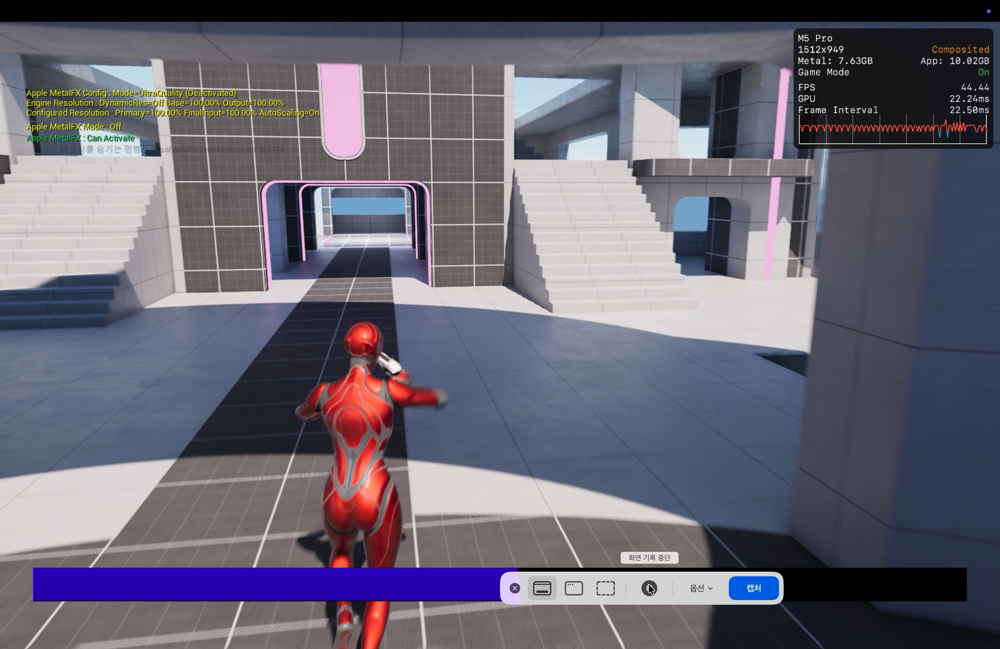
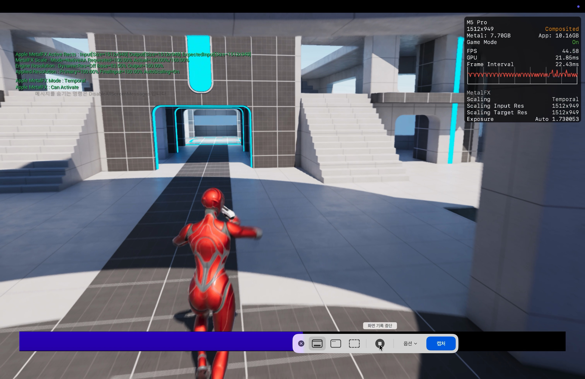
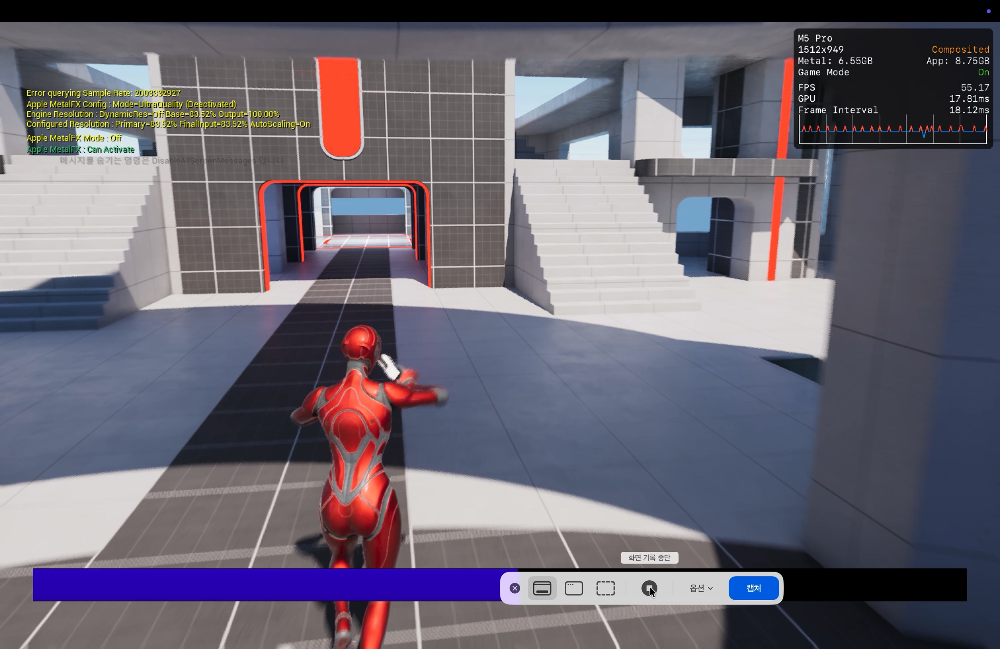
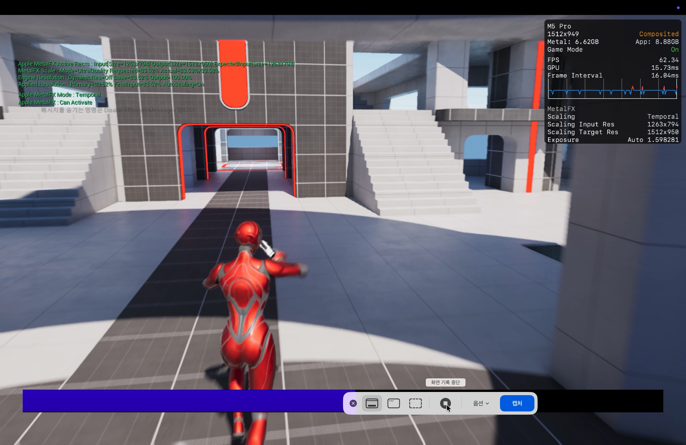
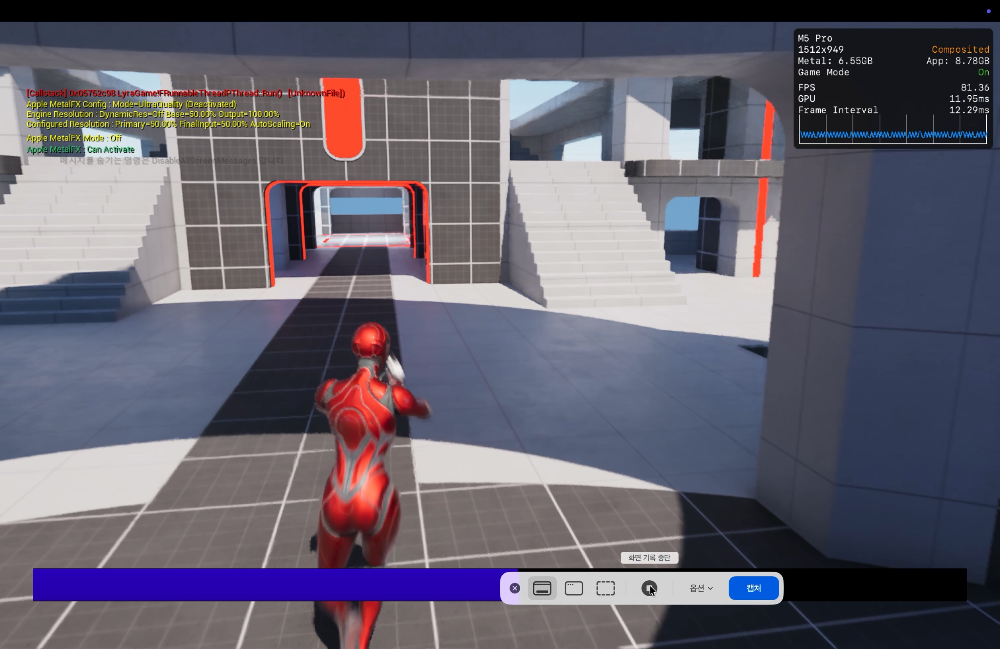
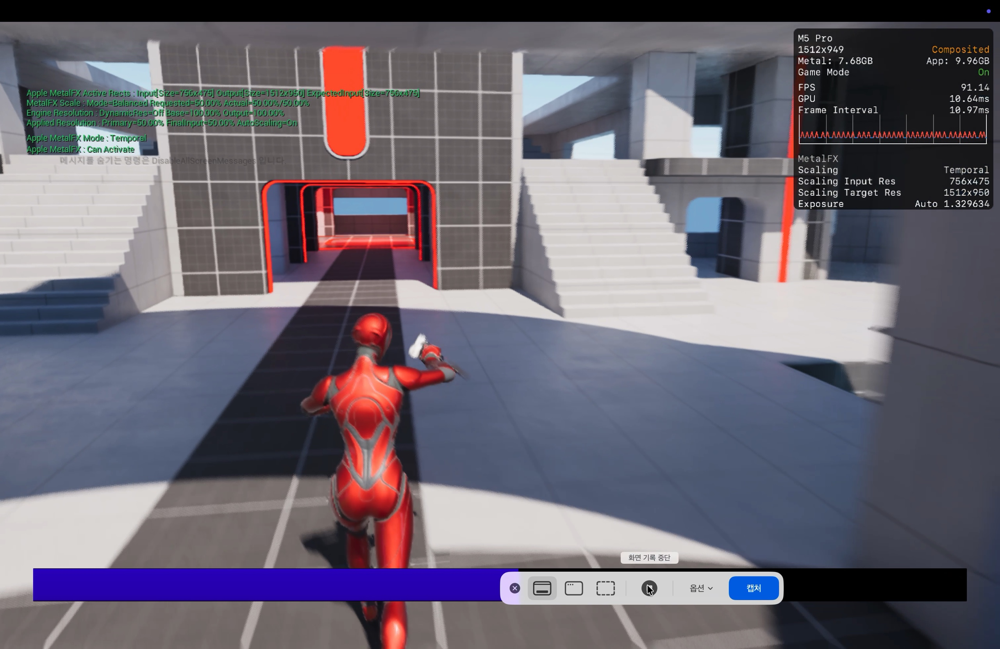
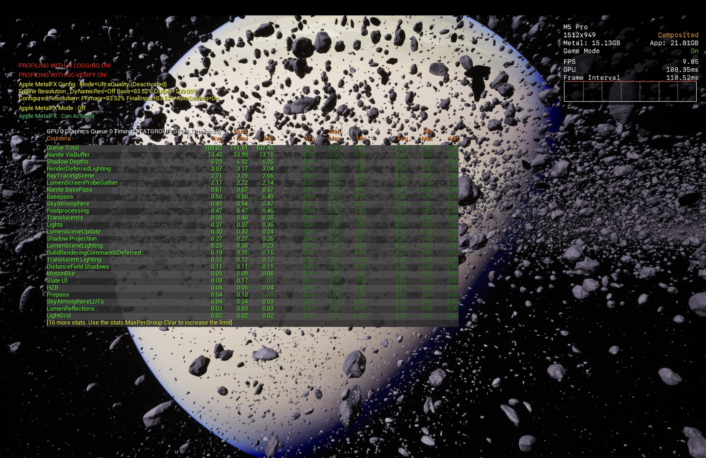
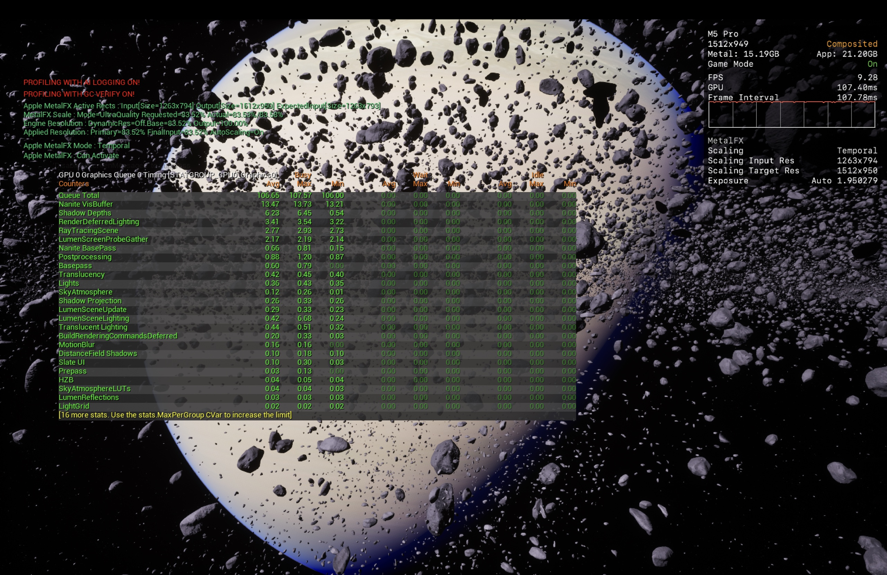

# Performance Validation

## Main Benchmark — Unreal Engine Lyra Sample

| Device | CPU | GPU | Memory |
|:------:|:---:|:---:|:------:|
| MacBook Pro / Apple M5 Pro | 15 cores (5 Super + 10 Performance) | 16 cores | 24 GB |

### Full-Sequence Average — 260726

| Input Scale | Upscaler Mode | Input → Output Resolution | FPS Avg | FPS Range | GPU Avg | GPU Range | Frame Interval Avg |
|:-----------:|:-------------:|:-------------------------:|--------:|:---------:|--------:|:---------:|-------------------:|
| **100.00%** | **Off** | 1512 × 949 → 1512 × 949 | **45.010** | 43.77–47.92 | **21.887 ms** | 20.45–22.51 ms | **22.228 ms** |
| **100.00%** | **Temporal NativeAA** | 1512 × 949 → 1512 × 949 | **45.055** | 43.90–46.15 | **21.537 ms** | 21.00–22.08 ms | **22.200 ms** |
| **83.52%** | **Off** | ≈1263 × 794 → 1512 × 949 | **55.540** | 54.34–58.78 | **17.644 ms** | 16.65–18.00 ms | **18.009 ms** |
| **83.52%** | **Temporal UltraQuality** | 1263 × 794 → 1512 × 950 | **62.248** | 60.50–65.16 | **15.684 ms** | 14.92–16.15 ms | **16.068 ms** |
| **50.00%** | **Off** | ≈756 × 475 → 1512 × 949 | **80.755** | 79.12–82.29 | **12.045 ms** | 11.79–12.34 ms | **12.384 ms** |
| **50.00%** | **Temporal Balanced** | 756 × 475 → 1512 × 950 | **90.179** | 86.75–92.31 | **10.702 ms** | 10.45–11.09 ms | **11.092 ms** |

### Full-Sequence Paired Comparison

| Input Scale | Comparison | FPS Difference | GPU Difference | Frame Interval Difference |
|:-----------:|:-----------|---------------:|---------------:|--------------------------:|
| **100.00%** | Temporal NativeAA vs. Off | **+0.045 (+0.10%)** | **-0.350 ms (-1.60%)** | **-0.028 ms (-0.13%)** |
| **83.52%** | Temporal UltraQuality vs. Off | **+6.708 (+12.08%)** | **-1.960 ms (-11.11%)** | **-1.941 ms (-10.78%)** |
| **50.00%** | Temporal Balanced vs. Off | **+9.424 (+11.67%)** | **-1.343 ms (-11.15%)** | **-1.292 ms (-10.43%)** |

### Specific Scene — Grenade Throw

| Input Scale | Upscaler Mode | FPS | GPU | Frame Interval |
|:-----------:|:-------------:|----:|----:|---------------:|
| **100.00%** | **Off** | **44.44** | **22.24 ms** | **22.50 ms** |
| **100.00%** | **Temporal NativeAA** | **44.58** | **21.85 ms** | **22.43 ms** |
| **83.52%** | **Off** | **55.17** | **17.81 ms** | **18.12 ms** |
| **83.52%** | **Temporal UltraQuality** | **62.34** | **15.73 ms** | **16.04 ms** |
| **50.00%** | **Off** | **81.36** | **11.95 ms** | **12.29 ms** |
| **50.00%** | **Temporal Balanced** | **91.14** | **10.64 ms** | **10.97 ms** |

### Grenade-Throw Paired Comparison

| Input Scale | Comparison | FPS Difference | GPU Difference | Frame Interval Difference |
|:-----------:|:-----------|---------------:|---------------:|--------------------------:|
| **100.00%** | Temporal NativeAA vs. Off | **+0.14 (+0.32%)** | **-0.39 ms (-1.75%)** | **-0.07 ms (-0.31%)** |
| **83.52%** | Temporal UltraQuality vs. Off | **+7.17 (+13.00%)** | **-2.08 ms (-11.68%)** | **-2.08 ms (-11.48%)** |
| **50.00%** | Temporal Balanced vs. Off | **+9.78 (+12.02%)** | **-1.31 ms (-10.96%)** | **-1.32 ms (-10.74%)** |

### Grenade-Throw Evidence

Replay playback may display some scene colors differently due to a replay-system bug. These color differences are not treated as upscaler quality differences.

#### 100% Input Scale

| MetalFX Off | MetalFX Temporal NativeAA |
|:---:|:---:|
|  |  |

#### 83.52% Input Scale

| MetalFX Off | MetalFX Temporal UltraQuality |
|:---:|:---:|
|  |  |

#### 50% Input Scale

| MetalFX Off | MetalFX Temporal Balanced |
|:---:|:---:|
|  |  |

## Stress Test — Unreal Engine CassiniSample

| Device | CPU | GPU | Memory |
|:------:|:---:|:---:|:------:|
| MacBook Pro / Apple M5 Pro | 15 cores (5 Super + 10 Performance) | 16 cores | 24 GB |

**Profiling Conditions:** `AI Logging` and `GC Verify` enabled

### Captured Results — 260725

| Engine Base | Upscaler Mode | Input Resolution | Output Resolution | FPS | GPU | Queue Total Avg | Queue Total Range | MetalFX |
|:-----------:|:-------------:|:----------------:|:-----------------:|----:|----:|----------------:|:-----------------:|:-------:|
| **100.00%** | **Off** | 1512 × 950 | 1512 × 950 | **8.72** | **114.20 ms** | **113.72 ms** | 113.21–114.58 ms | ❌ Disabled |
| **100.00%** | **Temporal NativeAA** | 1512 × 950 | 1512 × 950 | **8.92** | **111.65 ms** | **110.67 ms** | 110.10–111.50 ms | ✅ Active |
| **83.52%** | **Off** | ≈1263 × 794 | 1512 × 950 | **9.05** | **108.35 ms** | **108.02 ms** | 107.45–111.51 ms | ❌ Disabled |
| **83.52%** | **Temporal UltraQuality** | 1263 × 794 | 1512 × 950 | **9.28** | **107.40 ms** | **106.65 ms** | 106.00–107.57 ms | ✅ Active |

### Paired Capture Comparison

| Engine Base | Comparison | FPS Difference | GPU Difference | Queue Total Avg Difference |
|:-----------:|:-----------|---------------:|---------------:|---------------------------:|
| **100.00%** | Temporal NativeAA vs. Off | **+0.20 (+2.29%)** | **-2.55 ms (-2.23%)** | **-3.05 ms (-2.68%)** |
| **83.52%** | Temporal UltraQuality vs. Off | **+0.23 (+2.54%)** | **-0.95 ms (-0.88%)** | **-1.37 ms (-1.27%)** |

### Stress-Test Profiling Evidence

#### 100% Engine Base

| MetalFX Off | MetalFX Temporal NativeAA |
|:---:|:---:|
|  |  |

#### 83.52% Engine Base

| MetalFX Off | MetalFX Temporal UltraQuality |
|:---:|:---:|
|  |  |
